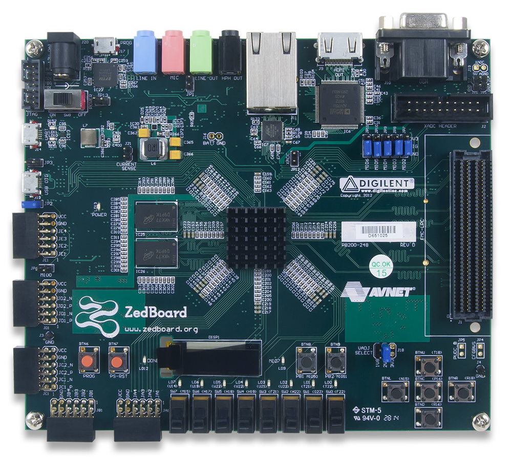

# Extended Tiny Encryption Algorithm (XTEA)

## Questions and reports to 
[s0559122@htw-berlin.de](mailto:s0559122@htw-berlin.de)

### Description
This repository was a project of my University [HTW-Berlin](https://www.htw-berlin.de/) in the subject Embedded Systems, first Master Semester. The Algorithm XTEA is divided into two algorithms.
1. Encrypt-Algorithm
2. Decrypt-Algorithm

Each algorithm is written in a single VHDL-File, can be found in folder software. There are no Testbench available, but I tested both VHDL-Files intensively. All the code was running on a [ZedBoard Zynq-7000 ARM/FPGA SoC Development Board](https://www.xilinx.com/products/boards-and-kits/1-elhabt.html.html) which has a ARM-Controller on board. On this ARM-Controller runs a Petalinux. The C-Code for communicating with the FPGA is also available on folder software.

XTEA has a loop in it, but implementing loops on a FPGA is difficult. Therefore I choose 64 steps for encrypting & decrypting, before the user is allowed to choose this and the FPGA has no more space on it.
All of the VHDL-Code was written with Vivado in VHDL.

### Structure
* software -> VHDL-Code & C-Code
* submissions -> tar-archive for the FPGA

The tar-archive contains two folders. 
1. ip-repo
2. zynq-system

For understanding why these both folders are needed are explained in section "Getting started"

### Getting Started
#### Requirements
* Installed 
