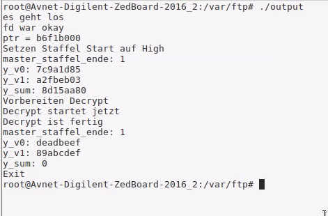

# Extended Tiny Encryption Algorithm (XTEA)

## Questions and reports to 
[s0559122@htw-berlin.de](mailto:s0559122@htw-berlin.de)

There is a video available on youtube how to create a **Bitstream-File** from a **simple VHDL-File** (Language is german)
[Video](youtube.com)


## Description
This repository was a project of my University [HTW-Berlin](https://www.htw-berlin.de/) in the subject Embedded Systems, first Master Semester. The Algorithm XTEA is divided into two algorithms.
1. Encrypt-Algorithm
2. Decrypt-Algorithm

Each algorithm is written in a single VHDL-File, can be found in folder software. There are no Testbench available, but I tested both VHDL-Files intensively. All the code was running on a [ZedBoard Zynq-7000 ARM/FPGA SoC Development Board](https://www.xilinx.com/products/boards-and-kits/1-elhabt.html.html) which has a ARM-Controller on board. On this ARM-Controller runs a Petalinux. Maybe others Linux Distribution works alao. The C-Code for communicating with the FPGA is also available on folder software.


XTEA has a loop in it, but implementing loops on a FPGA is difficult. Therefore I choose 64 steps for each algorithm encrypting & decrypting, before the user is allowed to choose this and the FPGA has no more space on it. So I used the maximum of XTEA for this FPGA.
All of the VHDL-Code was written with Vivado.

## Structure
* software -> VHDL-Code & C-Code
* vivado_files -> All files for flashing the FPGA

For understanding why these both folders needed, are explained in section "Getting started".

## Getting Started
### Requirements
* Cloned these repository
* Installed Vivado
* Running Petalinux (or other) on ARM-Controller of the Zynq Board
* Connection (I used SSH) to Petalinux.
* Simple Linux computer for cross-compiling the C-Code

### 1.
The C-Code must be cross-compiled for Petalinux. If you can compile directly on the ARM Controller do it. I can't, so I used the command 

```
arm-linux-gnueabihf-gcc code.c -o output
```
The Code should compile without any warnings or errors. Incase of problems contact me. 


### 2.
Transfer the compiled hex-code (in my case **output**) to the ARM-Controller (Petalinux).

### 3.
Open Vivado and load the file

```
vivado_files/zynq-system/zynq_system.xpr
```
It should look like on the picture. I used a another path so keep clear of confusion.


Then flash the Code to the FPGA. For this no Bitstream-File or anything needed. First we need to connect the Board with Viado.
On the left side by 
* Project Manager
* press "Generate Bitstream" (takes ~30min)
* press "Open Hardware Manager" (at the bottom)
* press "Open Target"
* press "Auto Connect"
Make sure this is successfully
Now we flash the program
* Project Manager
* press "Open Hardware Manager" (at the bottom)
* press "Program Device"

### 4.
After this we can execute the program on Petalinux. Normally this should work perfectly. If not, contact me and send me a screenshot of the output.

```
./output
```


## Conclusion
With this project it is possible to create a prototype for a encryption & decryption device. Maybe for transfering very sensitive data which can be decrypted only with custom hardware.

## Further Ideas
Pipelining of data. With this it is possible to encrypt & decrypt a bunch of data in almost zero time.

